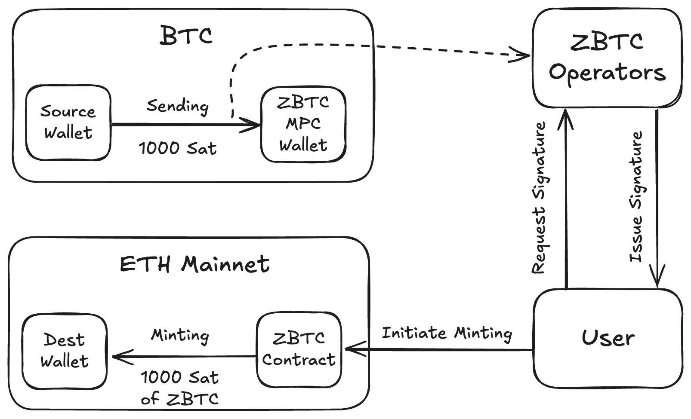
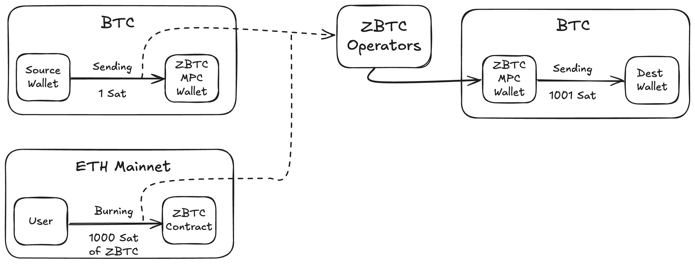

# Zellular BTC

Zellular BTC is a decentralized bridge from Bitcoin network to EVM-compatible chains hosted on eigenlayer and secured via resktaing. It uses [FROST](https://eprint.iacr.org/2020/852.pdf) protocol to enable EigenLayer nodes own an MPC wallet in a decentralized way using Schnorr Threshold Signatures.

## Functionalities

This project provides two main functionalities:

### Deposit BTC and Mint ZBTC

To bridge BTC to an EVM-based network, follow these steps:

- Transfer the desired amount of BTC to the MPC wallet.
- Send a request to the Signature Aggregator (SA) to ask for a signature:
    ```bash
   curl -X POST http://localhost:8000/mint -d '{"tx_hash": [deposit-tx-hash]' -H "Content-Type: application/json"
    ```

<div align="center" id="Components">
    
    <p><i><strong>Figure 1:</strong> This figure illustrates the process of bridging BTC from the Bitcoin network to an EVM-based network.</i></p>
</div>


### Burn ZBTC and Withdraw BTC

To bridge BTC back to the Bitcoin network:
- Deposit a negligible amount of BTC to the MPC wallet. The hash of this tx is used to prevent replay attack. The extra amount deposited here will be returned to you when you withdraw your BTC.
- Burn ZBTC on the EVM-based network by providing the hash of above tx.
- Submit a withdrawal request using the following command:
    ```bash
    curl -X POST http://localhost:8000/burn -d '{"tx_hash": [burn-tx-hash]}' -H "Content-Type: application/json"
    ```
<div align="center" id="Components">
    
    <p><i><strong>Figure 2:</strong> This figure illustrates the process of bridging BTC from an EVM-based network back to the Bitcoin network.</i></p>
</div>

## Setup

- Activate the Python virtual environment and install required packages:

```bash
$ git clone https://github.com/zellulr-xyz/zbtc.git
$ cd zbtc
$ virtualenv -p python3.10 venv
$ source venv/bin/activate
(venv) $ pip install -r requirements.txt
```

> [!TIP]
> Python version `3.10` or above is required.

- Set up the `.env` file using the provided `.env.example` as a reference:

```bash
$ cp .env.example .env
```

Then modify the `.env` file with the appropriate parameters:

```
# Path to the file containing validated IP addresses to request dkg and signature:
ZBTC_VALIDATED_IPS=./validated_ips.json

# Private key for the ZBTC node (in integer format)
ZBTC_PRIVATE_KEY=94337664340063690438010829915800780946232589158282044690319564900000952004167

# ZBTC smart contract address
ZBTC_CONTRACT_ADDRESS=0x0323C15f879C8c8F024154BF5179c75e2eb9cAaD

# Bitcoin MPC (Multi-Party Computation) address
ZBTC_MPC_ADDRESS=tb1p0wm4lp4enjz47y7qzne288gj9keffed58mmjz7exr0wlw02duq3ssw7y20
```

## Run

To run nodes, execute the following command:

```bash
$ python node.py [node_id]
```

Next, to initiate a Distributed Key Generation (DKG) for the MPC wallet, run:

```bash
$ python dkg.py [number of nodes] [threshold] [n] BTC mpc_wallet 
```

To set up a DKG for generating signatures for the EVM-side contract, use:

```bash
$ python dkg.py [number of nodes] [threshold] [n] ETH ethereum 
```

To run the signature aggregator, which acts as a client for the user, run:

```bash
$ python sa.py [number of nodes]
```
